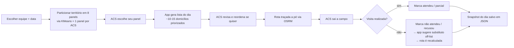
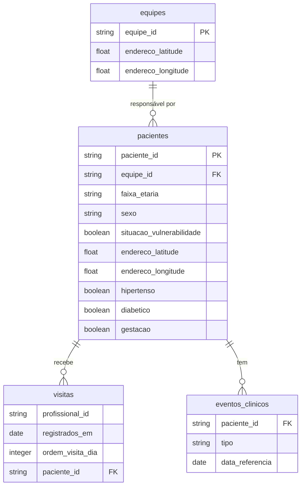

<div align="center">

# 🧭 Radar Família — Inteligência no Território para ACS

[](https://www.anthropic.com)
[](https://prefeitura.rio/)
[](https://streamlit.io)
[](https://project-osrm.org)

</div>

### **Nome da equipe:** Radar Família (G27)
### **Membros da equipe:**
    Ana Luisa Santos
    Gabriel de Albuquerque dos Santos
    João Pedro Oliveira
    Juliana Jansen Ferreira
### **Tema:** Saúde

### Apresentação
Video de Apresentação: https://drive.google.com/file/d/1vN3lv190kKVMaafIqZnxX6hNtr1uG52E/view?usp=sharing

### **Resumo:**
---

> **Radar Família** é um protótipo para apoiar o planejamento diário dos Agentes Comunitários de Saúde (ACS). Em uma tela: ele sugere **quais domicílios visitar hoje**, **em que ordem caminhar**, **por que cada família foi priorizada** e traça uma **rota a pé** entre eles. Quando o dia não sai como planejado, ele realoca substitutos e regera a rota. No fim, o ACS pode **imprimir** tudo e levar pra rua.

---
### Arquitetura / abordagem: como o Claude foi usado para construir e como ele atua dentro da aplicação
#### - Claude gerou a Matriz Família — Score de Risco por Domicílio que foi composta a partir da combinação dos Critérios de vulnerabilidade e risco (Escala de Risco Familiar) e Critérios por linha de cuidado (protocolos clínicos) como exemplo de como a priorização poderia ser pensada considerando a FAMÍLIA como o foco da visita e para a análise dos riscos
#### - Claude code ...
### Vídeo demo: demonstração de 60s. Opcional se a aplicação estiver publicamente acessível; obrigatório caso contrário.

## 🎯 O que a solução faz

- 🧮 **Monta a lista do dia** de cada ACS (~10–15 domicílios) a partir do panel territorial dele, com critério explicado linha a linha.
- 🚦 **Prioriza por risco clínico e social** — gestação, vulnerabilidade, diabetes, hipertensão, eventos clínicos recentes — sem perder a lógica geográfica do território.
- 🗺️ **Traça a rota a pé** com **OSRM self-hosted em tempo real, com dados de ruas verdadeiras**, respeitando a ordem que o ACS decidir, e **recalcula** sempre que algo muda em campo.
- 🖨️ **Gera versão imprimível** (HTML → PDF) da rota e da ficha de cada visita, pro ACS que vai a campo sem celular ou prefere anotar à mão.

---

## 👣 Fluxo do ACS



**Passo a passo:**

1. **Escolhe equipe e data.** Carrega o cadastro de pacientes daquela equipe.
2. **App divide o território em 8 panels** via KMeans (cada equipe tem 8 ACS — ver `app/lib/data.py:clusterizar`). Cada cluster é um proxy do panel de um ACS.
3. **ACS escolhe seu panel.** A partir daqui, tudo opera dentro daquele subconjunto.
4. **App gera a lista do dia** (ver §🧭 Ranqueamento) com motivos visíveis por domicílio.
5. **ACS revisa.** Pode reordenar manualmente, expandir cada família para ver os moradores, ler as flags clínicas.
6. **Rota é traçada** via OSRM a pé, partindo da UBS e seguindo a ordem do ACS.
7. **Em campo, o ACS marca o status** de cada visita. Não-atendido / recusou aciona busca de substituto e recalcula o trecho restante da rota.
8. **Fim do dia: snapshot persistido** em `app/data/dia/` como JSON. O snapshot do dia anterior alimenta o rerank do dia seguinte.

---

## 🧭 Ranqueamento — como a lista do dia é montada

A unidade de planejamento **não é o paciente**, é o **domicílio sintético** (`id_familia_sint`): uma grade territorial de **150m × 150m** que agrupa todos os pacientes da mesma equipe que caem na mesma célula. Toda lógica de seleção e status opera no nível do domicílio; o status individual de cada morador continua existindo e é agregado em runtime.

### Faixa de prioridade

Cada domicílio recebe um score baseado nas flags de seus membros (basta um membro ter a flag):

| Flag (qualquer membro)        | +score |
|-------------------------------|--------|
| gestação                      | 3      |
| vulnerabilidade (situação)    | 3      |
| diabético                     | 2      |
| hipertenso                    | 1      |
| ≥ 1 evento clínico            | 1      |

- score **≥ 4** → `alta`
- score **2–3** → `média`
- score **0–1** → `baixa`

### Ordem-base territorial

Não é por prioridade. É **nearest-neighbor planar a partir da UBS**: o próximo domicílio é sempre o mais próximo do ponto atual. Garante que a primeira render reflita uma rota minimamente conexa, sem virar TSP.

### As 3 pilhas da seleção do dia

A lista final combina, em ordem:

| Pilha            | Quem entra                                                                                              |
|------------------|---------------------------------------------------------------------------------------------------------|
| `forced_front`   | Reoferta forçada de **alta** prioridade do mês (no-show ou gap parcial em prioritário). Fura o cooldown. |
| `follow-ups`     | Domicílios cujo último status registrado é `não atendeu` ou `recusou atendimento`.                       |
| `frescos`        | Resto do panel que **não** foi atendido neste mês.                                                       |

Dentro de cada pilha, a ordem territorial é preservada, mas a banda de prioridade reordena (`alta` → `média` → `baixa`).

### Cadência mensal (exclusão dura)

Cada domicílio recebe ~1 visita por mês calendário. Quem foi atendido este mês **fica fora** do panel do dia — não vai pro fim da fila, simplesmente não aparece. Conta como atendido:

- status agregado `atendeu`, **ou**
- `parcialmente atendeu` **sem** gap em membro prioritário.

Quem **não** conta (continua elegível): `parcialmente atendeu` com gap em prioritário, `não atendeu`, `recusou atendimento`, `pendente`.

### Rerank no-show

Política durável: **quem não foi atendido sobe na próxima lista priorizada — não volta pro fim da fila.** Implementado via `prev_status` lido do snapshot mais recente anterior à data selecionada.

### Substituto em runtime

Quando o ACS marca um domicílio como `não atendeu` / `recusou atendimento` durante o expediente, o app procura um candidato off-list via `find_substitute_by_detour`:

- corredor de **300m** ao redor da rota restante;
- detour máximo **400m** ao inserir;
- inserção posicional onde o desvio é mínimo.

📖 Detalhe completo: [`docs/criterios-familias.md`](docs/criterios-familias.md).

---

## 🗺️ Roteamento (OSRM)

O traçado da rota usa um **OSRM self-hosted**, rodando em container Docker — definido em [`routing/docker-compose.yml`](routing/docker-compose.yml). Perfil **`foot`** (caminhada), exposto em `http://localhost:5050`.

- **Health check obrigatório no startup.** Se o OSRM não responde, o app avisa.
- **Waypoints na ordem fixa do ACS.** Passamos `coordinates = [UBS, ...ordem]` com `?steps=false`, **sem `roundtrip`** e **sem otimização de waypoints**. O OSRM **não decide** a ordem — ele só desenha o caminho.
- **Recalculável a qualquer momento.** Toda mutação da `ordem` (reordenação manual do ACS, inserção de substituto, exclusão) dispara uma nova chamada ao `/route`, redesenhando o traçado e atualizando duração/distância estimadas.

> ⚠️ **Limitação honesta:** a cobertura do OpenStreetMap em comunidades é incompleta. As rotas são **aproximadas** e não devem ser tratadas como instrução operacional de campo — servem para dimensionar o dia e orientar a sequência.

Setup do OSRM: ver [`routing/README.md`](routing/README.md).

---

- Apresentação: [Acessar](https://docs.google.com/presentation/d/1hf5jq8iFGiDaf3u5UA4Jtd7wQ7eWWchfEn6Fvm0ArOM/edit?usp=sharing)
- Briefing: [Acessar](https://docs.google.com/document/d/1hwk6J7hjSNvCJL2QLxpYUdCjB7u1ec3A/edit?usp=drivesdk&ouid=106557418309843613513&rtpof=true&sd=true)
- Fichas dos ACS: [Acessar](https://drive.google.com/drive/folders/1ijvL9OygVKBWt5y1sbm9_o9kgK97EepY?usp=sharing)

O ACS pode baixar a rota do dia como um **HTML autocontido** (botão **"🖨️ Baixar rota imprimível"** na UI). O arquivo abre em qualquer navegador e está pronto para `Cmd+P` (ou "Salvar como PDF").

O HTML traz:

- 🗂️ **Cabeçalho** — equipe, ACS, data, nº de paradas, duração estimada, distância.
- 🗺️ **Mapa estático embutido** — UBS, paradas numeradas, traçado azul da rota OSRM.
- 📋 **Tabela da rota** — uma linha por domicílio, com:
  - `#` da parada;
  - **id do domicílio** + lista de moradores discriminados (id curto, sexo, faixa etária, flags clínicas, marcação **★ prioritário**);
  - coluna **Endereço** em branco — pautada — para o ACS preencher à mão;
  - **Status** (badge colorido) salvo digitalmente;
  - **☐** checkbox impresso para anotação manual.
- 🔁 **Substitutos** aparecem prefixados com `🔁` na linha.

CSS `@media print` com `@page A4` garante quebras de página razoáveis e oculta controles. Funciona em dia editável **e** em snapshot passado (read-only).

---

## 🏗️ Como rodar

### 1. Dados

Os Parquets do desafio **não estão commitados**. Coloque em `~/Documents/`:

- `equipes_anonimizadas.parquet`
- `pacientes_anonimizados.parquet`
- `visitas_anonimizadas.parquet`
- `eventos_clinicos_anonimizados.parquet`

Downloads na seção [📊 Dados do desafio](#-dados-do-desafio) abaixo.

### 2. OSRM

```bash
cd routing
docker compose up -d
# OSRM foot em http://localhost:5050
```

Para crop/build do grafo, ver [`routing/README.md`](routing/README.md).

### 3. App Streamlit

```bash
cd app
streamlit run streamlit_app.py
# abre em http://localhost:8501
```

---

## 📂 Estrutura do repositório

```
app/
  streamlit_app.py          # UI e fluxo de planejamento
  lib/
    data.py                 # parquet, clusterização, seleção, substitutos
    osrm.py                 # health check + chamada ao /route
    state.py                # snapshots JSON em app/data/dia/
  data/dia/                 # persistência de snapshots (gitignored)

routing/
  docker-compose.yml        # serviços OSRM (foot + car)
  scripts/                  # download/crop/build do OSM
  README.md

docs/
  criterios-familias.md     # detalhe da heurística de ranking/rerank

notebooks/                  # exploração

README.md                   # você está aqui
CLAUDE.md                   # guia para o Claude Code
```

---

## ⚠️ Limitações conhecidas

- 🧪 **Heurística de ranking é placeholder.** É a melhor proxy que conseguimos com flags clínicas/sociais simples — não substitui um ranker treinado com desfechos reais.
- 🔒 **Dados anonimizados.** Indicadores absolutos **não refletem a realidade**. Coordenadas têm ~100m de ruído e endereços foram embaralhados dentro do território da equipe. Use a solução como **prototipagem de lógica territorial**, não como ferramenta operacional.
- 🗺️ **OSM em comunidades é incompleto.** A rota desenhada é uma aproximação.
- 🧷 **Sem suite de testes formal.** Validação é manual via UI.
- 📦 `streamlit-sortables` está listado nas deps mas o app atual não o usa.

---

## 📊 Dados do desafio

<div align="center">

| 🗂️ **Tabela** | 📝 **Descrição** | 🔗 **Download (PARQUET)** |
|:--------------|:-----------------|:--------------------------|
| **Cadastros de Pacientes** | Cadastros anonimizados | [📥 Download](https://drive.google.com/file/d/1cRvsx5poNTi4EOfWHYvilSDF4_i6hcZy/view?usp=drive_link) |
| **Eventos Clínicos** | Consultas agendadas e eventos de urgência/emergência | [📥 Download](https://drive.google.com/file/d/1rcWQbi_vA_RAnXLQV79oe4Z2mql8cn3_/view?usp=drive_link) |
| **Visitas dos ACS** | Histórico de visitas | [📥 Download](https://drive.google.com/file/d/1dKJ8BpqrmsFNQoVcs9tjJ-Gaag1WzCML/view?usp=drive_link) |
| **Equipes de Saúde** | Equipes e sede (UBS) | [📥 Download](https://drive.google.com/file/d/1h8DijXrZM_hnhYMAdkggp5mnb2zckFOW/view?usp=drive_link) |

</div>

### Modelo de dados



---

## 📚 Materiais de apoio

- 🎤 [Apresentação do desafio](https://docs.google.com/presentation/d/1hf5jq8iFGiDaf3u5UA4Jtd7wQ7eWWchfEn6Fvm0ArOM/edit?usp=sharing)
- 📄 [Briefing](https://docs.google.com/document/d/1hwk6J7hjSNvCJL2QLxpYUdCjB7u1ec3A/edit?usp=drivesdk&ouid=106557418309843613513&rtpof=true&sd=true)
- 📘 [Manual do ACS — Ministério da Saúde](http://189.28.128.100/dab/docs/publicacoes/geral/manual_acs.pdf)
- 🏛️ [Repositório principal do município](https://bibliotecasus.subpav.org/)

---

## 🔒 Sobre a anonimização (resumo)

Os dados passaram por hash SHA256, amostragem cadastral (2.000 pac/equipe), date shifting (preservando ordem intra-paciente), ruído geográfico de até **100m**, embaralhamento de endereços dentro do território da equipe, generalização e k-anonymity ≥ 5.

**O que sobrevive:** sequência temporal, dinâmicas do sistema, lógica territorial aproximada, padrões de comportamento.
**O que NÃO sobrevive:** indicadores absolutos, geolocalização precisa, mapeamento território-paciente exato, datas reais.

📖 Detalhamento das técnicas: [HIPAA Safe Harbor](https://www.hhs.gov/hipaa/for-professionals/privacy/special-topics/de-identification/index.html) · [K-Anonymity](https://en.wikipedia.org/wiki/K-anonymity) · [Differential Privacy](https://en.wikipedia.org/wiki/Differential_privacy).
